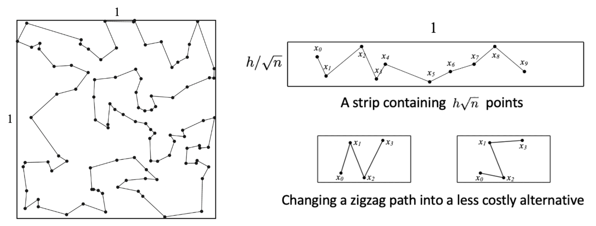

# A New Upper Bound for the Euclidean TSP Constant

**Authors**: Julien Yu, John Carlsson

**Contact**: yyu56253@usc.edu, jcarlsso@usc.edu

## Description

This paper presents a computer-aided proof of a novel approach to constructing a new upper bound for the Euclidean Traveling Salesman Problem (TSP) Constant, leveraging numerical methods and decision trees. While the improvement achieved is modest, the approach offers a key advantage: it is primarily constrained by computer hardware, making it highly amenable to further optimization and advancements over time.

This repository contains the implementation used to compute these upper bounds through advanced numerical methods and algorithms. The project is designed for efficiency, utilizing interval arithmetic (mpmath.iv) and other mathematical libraries. Key functionalities include calculations for leaf contributions.

## License

This project is licensed under the Apache License, Version 2.0. See the LICENSE file or visit the [Apache License 2.0](https://www.apache.org/licenses/LICENSE-2.0) for details.

## Requirements

Install the dependencies using the provided `requirements.txt` file:
```bash
pip install -r requirements.txt
```

## Overview: permutations and zigzags

Consider a path *(X<sub>0</sub>,Y<sub>0</sub>),...,(X<sub>k</sub>,Y<sub>k</sub>)*, where by construction we have *X<sub>0</sub> ≤ ··· ≤ X<sub>k</sub>*. Let *Y<sub>i</sub> = √h U<sub>i</sub>*, where *U<sub>i</sub>* is uniform on the interval [0,1]. The difference between consecutive *x*-coordinates, *X<sub>i+1</sub> − X<sub>i</sub>*, follows a scaled exponential distribution as *n → ∞*.

| Figure 1: How zigzags could contribute to the upper bound of TSP |
| -------- |
|  |

The central idea to our improved upper bound is the replacement of the horizontal traversal strategy with a more general sequence. Specifically, we consider the same set of strips of height *h/√n*, but we now consider ordered (*k+1*)-tuples *(X<sub>i</sub>,Y<sub>i</sub>),...,(X<sub>i+k</sub>,Y<sub>i+k</sub>)* for fixed (small) *k*, and select the permutation that minimizes the total path length of those *k+1* points, as shown in Figure 2. Note that it is necessary to restrict ourselves to those permutations that begin with the leftmost endpoint *(X<sub>i</sub>, Y<sub>i</sub>)* and end with the rightmost endpoint *(X<sub>i+k</sub>,Y<sub>i+k</sub>)*, because we have to stitch all of the paths together to form a single path. The original bound simply corresponds to the case where *k = 1* (or *k = 2*, since the endpoints are fixed).

| Figure 2: Six possible permutations when *k = 4* |
| -------- |
|  |

## Construction of decision tree

To construct a decision tree, run the command:
```bash
python3 scripts/main.py
```

*n_sample* controls the size of the training dataset. *h* is the hyperparameter that controls the relative width of each horizontal strip. *helper.py* includes all the procedures to calculate antiderivatives and integrals and to select hyperrectangles in 10 dimensions. *main.py* calls the function *leaf_contribution* from *helper.py*, builds the decision tree, and calculates the overall improvement.

To load an example decision tree, run the command:
```bash
python3 scripts/load_tree.py
```

| Figure 3: Illustration of a hyperrectangle in the 5-point / 6-permutation scenario |
| -------- |
|  |

Figure 3 displays an instance of a 9-dimensional hyperrectangular box *B ⊂ D = {(x<sub>1</sub>, ..., x<sub>k</sub>, u<sub>0</sub>, ..., u<sub>k</sub>): 0 = x<sub>0</sub> ≤ x<sub>1</sub> ≤ ... ≤ x<sub>k</sub>, 0 ≤ u<sub>i</sub> ≤ 1}*, portrayed on the coordinate plane as a line segment and four rectangular regions.

| Figure 4: Theoretical improvement limit under different selections of *h* and *k* |
| -------- |
|  |

Figure 4 illustrates how larger *k* could potentially lead to further improvements of the upper bound. As *k* increases, we had better select larger *h*.

| Figure 5: Setting *k = 4*, new upper bounds for multiple selections of *h*, as *N* increases |
| -------- |
|  |

Figure 5 shows how the guaranteed upper bound of *β<sub>2</sub>* improves as the training dataset size *N* increases. The computation time grows linearly.

The selection of *h* would also affect *β<sub>2</sub>*. Under our current computational limit, *h = √3.25* gives us a better upper bound than *h = √3, √3.5*.

## List of Functions in *helper.py*

* Fu_4, Fuv_4, Fxuv_4, Fxyuv_4, x4: Calculate integrals for the first *k-1* summands using antiderivative (*k = 4*)

* Fu_4out, Fuv_4out, Fxuv_4out, x4_x4out: Calculate integral for the last summand using antiderivative

* F4: Calculate antiderivative using FriCAS for the first *k-1* summands (*k = 4*)
    * Input variables: *x<sub>i</sub>, x<sub>j</sub>, u<sub>i</sub>, u<sub>j</sub>*; all numeric
    * Output: FriCAS antiderivative for the first *k-1* summands

* F4_x4out: Calculate antiderivative using FriCAS for the last summand
    * Input variables: *x<sub>i</sub>, x<sub>k</sub>, u<sub>i</sub>, u<sub>k</sub>*; all numeric
    * Output: FriCAS antiderivative for the last summand, leaving *dx<sub>k</sub>* out

* tangent, x4_tangent: Return the underestimation of the last summand
    * Input variables: *x, y, u, v*; stands for *[s<sub>i</sub>, t<sub>i</sub>], [s<sub>k</sub>, t<sub>k</sub>], [a<sub>i</sub>, b<sub>i</sub>], [a<sub>k</sub>, b<sub>k</sub>]*
    * Output: quadratic lower bound of the last summand, derived from the multiplication of two tangent lines

* secant, x4_secant: Return the overestimation of the last summand
    * Input variables: *x, y, u, v*; stands for *[s<sub>i</sub>, t<sub>i</sub>], [s<sub>k</sub>, t<sub>k</sub>], [a<sub>i</sub>, b<sub>i</sub>], [a<sub>k</sub>, b<sub>k</sub>]*
    * Output: quadratic upper bound of the last summand, derived from the multiplication of two secant lines

* x4_0101, x4_0202, ..., x4_2323: Calculate length of segments (not the last segment)
    * Input variable: *box*; hyperrectangle *[s<sub>0</sub>, t<sub>0</sub>], ..., [s<sub>4</sub>, t<sub>4</sub>], [a<sub>0</sub>, b<sub>0</sub>], ..., [a<sub>4</sub>, b<sub>4</sub>]*
    * Output: exact length of a non-last segment

* x4_LB_3434: Return the underestimation of the last segment 3 -> 4
    * Input variable: *box*
    * Output: underestimation of the segment length 3->4

* x4_UB_1414, x4_UB_2424, x4_UB_3434: Return the overestimation of the last segment
    * Input variable: *box*
    * Output: overestimation of the segment length 1->4, 2->4, 3->4

* calc_01234_LB: Calculate the underestimation of the identity (permutation) path
    * Input variable: *box*
    * Output: underestimation of the path length

* calc_01324_UB, ..., calc_03214_UB: Calculate the overestimation of a non-identity (permutation) path
    * Input variable: *box*
    * Output: overestimation of the path length

* contribution: Calculate the contribution of a hyperrectangular box to the upper bound
    * Input variable: *box*
    * Input variable: *label*; best permutation index that could be 0, 1, 2, 3, 4, 5
    * Output: nonnegative improvement to the upper bound

* check_monotone: Check if a hyperrectangle is legitimate
    * Input variable: *box_array*; candidate hyperrectangle with possible violations (e.g., *a<sub>i</sub> > b<sub>i</sub>*)
    * Output: boolean that returns True if and only if the hyperrectangle is legitimate

* special_box: "Prune" a region inside the multidimensional hyperspace
    * Input variable: *box_array*
    * Output: an updated region inside the multidimensional hyperspace

* leaf2box: Generate a hyperrectangular box array from a pure leaf node of the decision tree
    * Input variable: *leaf*; a pure leaf node of the decision tree, with known genealogy
    * Output: a hyperrectangular box

* leaf_contribution: Calculate a leaf node's contribution to the overall upper bound; to be imported into *main.py*
    * Input variable: *leaf*
    * Output: nonnegative amount of contribution to the overall upper bound

## List of Functions in *main.py*

* generate_data: Generate data frame with *n_sample* rows and 11 columns
    * 10 feature columns: *x<sub>0</sub>, ..., x<sub>4</sub>, u<sub>0</sub>, ..., u<sub>4</sub>*, considering the 5-point / 6-permutation scenario
    * 1 label column (0-5 representing the six permutations, in lexicographic order)

* calc_cross_entropy: Calculate cross entropy
    * Input variable: *data*; a subset of rows in the training data
    * Output: nonnegative value of cross entropy

* calc_info_gain: Calculate information gain from a split
    * Input variable: *threshold*; arbitrary splitting threshold
    * Input variable: *feature*; arbitrary feature column
    * Input variable: *data*
    * Output: nonnegative value of information gain resulting from a split

* calc_threshold: Decide the feature and threshold to perform a split
    * Input variable: *data*
    * Output: the best feature-threshold combination

* Node (class): A node in the decision tree
    * Attribute: *left*; left child
    * Attribute: *right*; right child
    * Attribute: *label*; label (only applicable to leaf nodes)
    * Attribute: *feature*; feature derived from *calc_threshold*
    * Attribute: *threshold*; threshold derived from *calc_threshold*
    * Attribute: *ancestor*; list of all ancestor nodes of the current node

    * insert: Link a node to its left and right children
        * Input variable: *leftchild*; the left child
        * Input variable: *rightchild*; the right child

* Tree (class): The decision tree structure
    * Attribute: *ancestor*
    
    * create_decision_tree: Build decision tree and update the global variable *leaf_nodes*
        * Input variable: *data*
        * Input variable: *leaf_nodes*; initialized as an empty list, capture all leaf nodes

* worker: Perform multiprocessing with the function *leaf_contribution* called from *helper.py*
    * Input variable: *leaf*; a pure leaf node of the decision tree
    * Output: contribution of the leaf node to the upper bound

* main: Calculate the overall improvement to the upper bound
    * Step 1: generate data with *generate_data*
    * Step 2: construct tree with *create_decision_tree* from the class *Tree*, update the list *leaf_nodes*
    * Step 3: calculate each leaf node's contribution to the upper bound in parallel with *worker*
